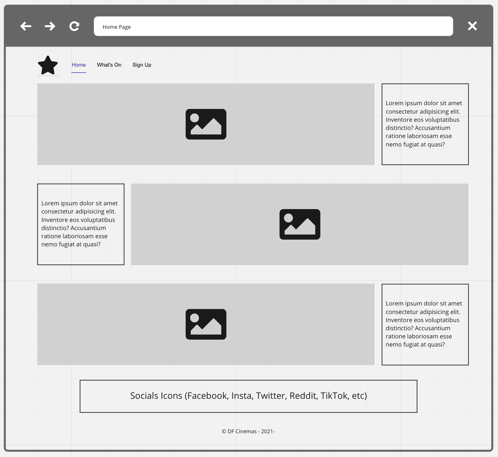
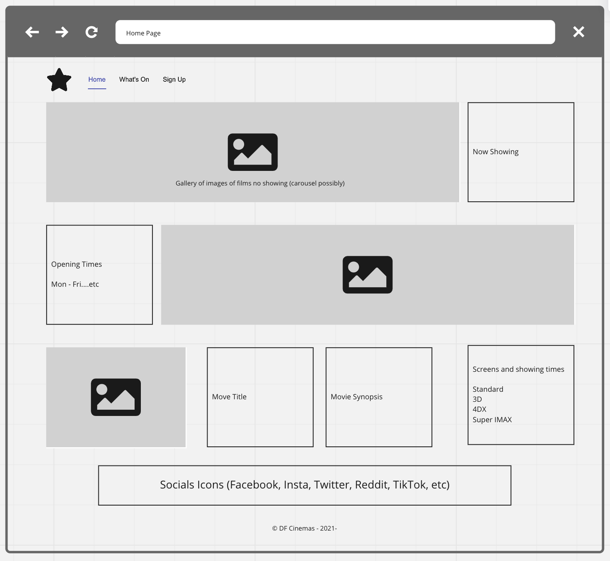
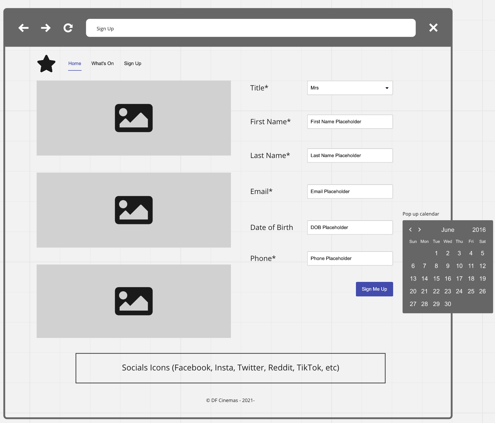

# Web Fundamentals Group Hackathon

Your first experience of a slightly larger project in a group! You will be working in your peer groups for the day to create a static website for DF Cinemas. You will be using the skills you have learned so far in the course to create a website that meets the requirements of the business.

It is suggested that you try and finish Part 1 in the morning session and then move onto Part 2 in the afternoon session. If you are unable to finish Part 1 in the morning session, you should continue working on it in the afternoon session.

## Part 1 - Overview

In this Hackathon you will be presented with the requirements to create a static but responsive website for DF Cinemas.

DF Cinemas has approached us to create a modern looking website promoting their cinemas. In the first iteration, they would like to be able to provide their customers with general information about their cinemas, what's on and opening hours and allow them to subscribe to receive some promotional materials.

The business representatives have worked with our UI/UX team and they have created the following low fidelity mock-ups.  They understand that their customers view their pages on different devices and want us to accommodate to this. The site will be split into three pages –

- home page with information about the Cinemas;
- a 'what's on' page displaying opening hours and movies showing this week;
- a 'signup' page to gather some information about the user.

The navigation between the pages should be easy and straightforward, with a navigation bar on top of each page.

## Part 1 - User Stories

The User Stories have been prioritised and ordered from 1 (most important) to 5 (least important):

1. As a User, I want to be presented with a home page, so that I can see some general information and pictures showing DF Cinemas.
2. As a User, I want to be able to see the opening hours of the cinema, so that I know when the cinema is open.
3. As a User, I want to be able to see the what movies are on this week, so that I know what is on and at what time.
4. As a User, I want to be able to subscribe to the website using a form, so that I can receive the latest promotions and information.
5. As a User, I want to be able to access the website on any device, so that I can access the information I need on the device of my choice.
6. As a User, I want to be able to see an immediate validation of my input into the sign-up form, so that I know if the information I enter will be acceptable.

## Wireframes

The wireframes for the website are available in the `images` folder.  The wireframes are low fidelity and are intended to give you an idea of the layout and content of the pages.  You should use these wireframes as a guide when creating the website.  The image placeholders shown in the wireframes should be replaced with suitable images that are cinema or movie related, such as popcorn, cinema seats, people watching a movie in a cinema, etc (the team has discretion here!).  ***`lorem ipsom`*** text can be replaced with suitable copy, as suggested by the wireframes, but it is also acceptable to keep the placeholder text there.  As for the colour scheme, the customer has asked for a modern and appealing colour scheme that is inclusive and accessible - as detailed in the "Additional User Requirements" section below.

---

### Home Page Wireframe

---

### Whats On Wireframe

---

### Signup Wireframe

---

##  Acceptance Criteria

The following table gives information about the validation that should be implemented on form fields.  Supplementary information is provided under the table.

| Form Field   | Validation       | Further Information |
| ----------- | ------------- | ------------------- |
| `title`           | **Required** |                                     |
|`firstName` | **Required** | Only lower and upper case letters are allowed, otherwise “Only lower and upper case letters are allowed” message will be displayed below the First Name field in red and the field itself will have red border.   Only names longer than 1 character and shorter than 15 characters are allowed, otherwise a message reading “The First Name entered is either too short or too long.” will be displayed below the First Name field and the field will have red border. |
| `lastName` | **Required** | As above but applied to `lastName` |
| `email`        | **Required** | Every valid email address follows this pattern: at least one character, `@` sign, one or more characters, `.` character and one or more characters. In case an invalid email address is entered a message reading “Email address not valid” will be displayed below the field in red and the field’s border will change to red. |

- If information entered into a required field is valid, the field’s border will remain unchanged and no additional message will be displayed.
- The validation is performed immediately after the user finishes typing into a field and the cursor is changed into another field.
- Other fields on the form do not require validation.

## Additional User Requirements

- Fonts and colour scheme should be consistent across the site, should be modern and appealing and inclusive - accessibility is very important to the customer!
- The submit button should be disabled until the required fields on the form are valid.

---

## Coding Style and Standards

- Code should be written using the latest JavaScript specification.
- All JavaScript code should be tested
- Code should be appropriately indented using a 4-space indent style.
- HTML, CSS and JavaScript should be kept in their own files where possible.

---

## Suggested Ways of Working

- Use the Agile methodology to help manage the team's work including a Kanban board
- Use pair programming to help share knowledge and skills
- Use Git branches to help manage the team potentially working on different parts of the project at the same time
- Use Discord to help manage communication within the team but stay on Zoom and use the breakout rooms too!
- Spend the first part of the morning planning and discussing the project as a team, that could include:
  - Discussing the requirements and acceptance criteria and how to go about meeting them
  - Creating a Kanban board and defining a "Definition of Done"
  - Agreeing on the technologies and tools to be used (e.g. Vanilla, Frameworks and Testing Tools)
  - Agreeing on a pair programming strategy, including assigning pairs and if you will rotate pairs during the day
- Check in with the whole team regularly to ensure everyone is on track and to help manage any blockers
- When using Git, commit often and always ***pull*** before you ***push*** to identify and resolve any conflicts as soon as possible
- Remember that HTML is for content, CSS is for style and JavaScript is for behaviour!
  - HTML can be developed independently of CSS and JavaScript
  - CSS can be developed independently of HTML and JavaScript
  - JavaScript can be developed independently of HTML and CSS
- HAVE FUN!

---

## Show and Tell

At some point after the hackathon, each group will be asked to present their work to the rest of the class. This will be an opportunity to show off your work and to discuss the challenges you faced and how you overcame them.

This may not be at the end of the day.

---

## FAQs

- *Will the project be assessed?*
    No, this is a formative exercise to help you practice your skills and to work in a group.
- *What if we don't finish the project?*
    That's okay, you can continue working on it after the hackathon if you want to.
- *What if we finish the project?*
    That's great! Its not like you haven't got a million and one other things you could direct your time to!
- *Where can we get images from?*
    You can use images from [Pexels](https://www.pexels.com/search/cinema/).
- *Do we have to stick to the layouts in the wireframes?*
    Broadly, yes!  These are what the customer has asked for.  However, you can make small changes if you think it will improve the design.
- *What if we have other questions?*
    Collaborate with other teams if you get really stuck.  Your trainer may respond to polite messages on Discord if asked nicely!
-
